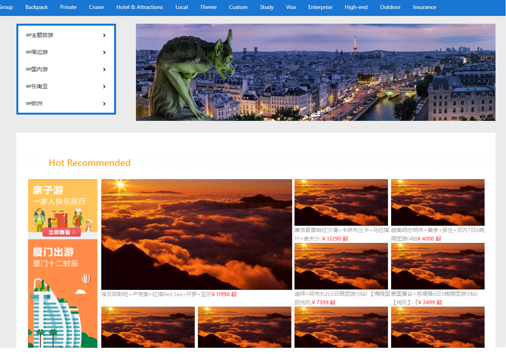

# Xiecheng: A Travel Website

This project was bootstrapped with [Create React App](https://github.com/facebook/create-react-app).

Developed with react.js, antd, json-server.

## Available Scripts

In the project directory, you can run:

strat json-server:

### `json-server --watch .\db.json --port 5000`

start app:

### `npm start`

Runs the app in the development mode.\
Open [http://localhost:3000](http://localhost:3000) to view it in the browser.
